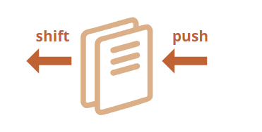
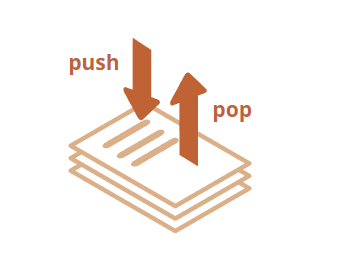
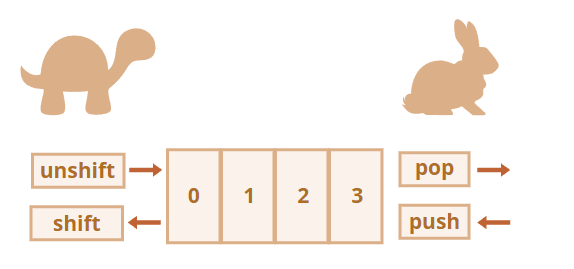
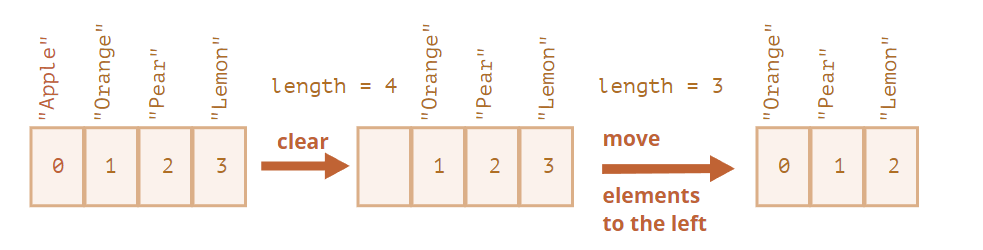
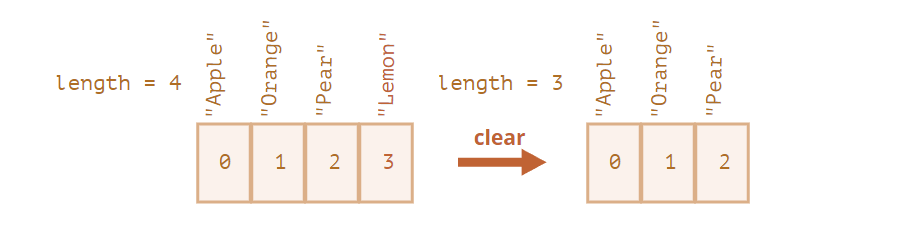

## JavaScript基础语法

> **在HTML中，推荐使用双引号。**
>
> **在JavaScript中，推荐使用单引号。**
>
> 符号两端最好各自有一个空格，推荐插件`JS-CSS-HTML Formatter`可以直接格式化
>
> 本笔记的内容安排跟随[Pink老师的视频课](https://www.bilibili.com/video/BV1Sy4y1C7ha?p=97&spm_id_from=pageDriver)，同步参考了[现代JavaScript教程](https://zh.javascript.info/)

### 1.初识JavaScript

- JavaScript是一种运行在客户端的脚本语言（不需要编译，通过js解释器逐行解释并执行）
- 可以通过Node.js进行服务器端的编程

- JavaScript最初的目的是为了进行表单动态校验的

#### 1.1浏览器如何执行js


- 渲染引擎
- JS引擎

#### 1.2数据类型


- JavaScript是一种弱类型/动态语言，不用提前声明白变量的类型，在程序的运行过程中，类型会自动被确定
- 变量的数据类型是根据`=`右边的值的数据类型来确定的
- JavaScript是动态语言，变量的数据类型是可以变化的

- 数字型Number：有三个特殊值：

  - `infinity` 正无穷
  - `-infinity` 负无穷
  - `NaN (Not a Number)` 结果不是数字

- 八进制：在数字前加`0`（数字零）

- 十六进制：在数字前加`0x`

- 字符串可以单双引号互相嵌套：（但肯定转义符更好，这边主要是为了提醒一下，还有这种表示方法）

  ```js
  let aString= '这句话是"单引号"嵌套双引号'
  ```

- 字符串拼接：

  

#### 1.3解释型语言和编译型语言


#### 1.4运算符

- 一元运算符

  如果将**一元加运算符**用到非数值，将会执行和Number函数相同的类型转换。

  例如：

  这里有一段代码，要求用户输入两个数字并显示它们的总和。

  它的运行结果不正确。下面例子中的输出是 `12`（对于默认的 prompt 的值）。

  为什么会这样？修正它。结果应该是 `3`。

  ```javascript
  let a = prompt("First number?", 1);
  let b = prompt("Second number?", 2);
  
  alert(a + b); // 12
  ```

  **解决方案**

  原因是 prompt 以字符串的形式返回用户的输入。

  所以变量的值分别为 `"1"` 和 `"2"`。

  ```javascript
  let a = "1"; // prompt("First number?", 1);
  let b = "2"; // prompt("Second number?", 2);
  
  alert(a + b); // 12
  ```

  我们应该做的是，在 `+` 之前将字符串转换为数字。例如，使用 `Number()` 或在 `prompt` 前加 `+`。**（利用一元加运算符改变数据类型）**

  **区别是什么呢：`+`做一元运算符的时候，可以用来改变数据类型，做二元运算符的时候，若前后两量有一个为字符串，将执行字符串拼接**

  例如，就在 `prompt` 之前加 `+`：

  ```javascript
  let a = +prompt("First number?", 1);
  let b = +prompt("Second number?", 2);
  
  alert(a + b); // 3
  ```

  或在 `alert` 中：

  ```javascript
  let a = prompt("First number?", 1);
  let b = prompt("Second number?", 2);
  
  alert(+a + +b); // 3
  ```

  在最新的代码中，**同时使用一元和二元的 `+`**。看起来很有趣，不是吗？


- 常见的基础用法

  

- 前置/后置递增运算符（注意运算顺序即可）

  实际开发过程中，使用后置运算符，并独占一行

  ```javascript
  //前置运算符
  let a=10,b=10;
  let c= ++a + b;//21
  let d= a + b;//21
  //等效于
  let a=10,b=10;
  a=a+1;
  let c= a + b;//21
  let d= a + b;//21
  ```

  ```js
  //后置运算符
  let a=10,b=10;
  let c= a++ + b;//20
  let d= a + b;//21
  //等效于
  let a=10,b=10;
  let c= a + b;//20
  a=a+1;
  let d= a + b;//21
  ```

  

- 比较运算符

  - `==`默认转换数据类型

    ```js
    console.log(12 == 12); //true
    console.log(12 == '12'); //true
    ```

  - 避免上述情况，有全等的概念`===`，要求数据和数据类型都一样

    ```js
    console.log(12 === 12); //true
    console.log(12 === '12'); //false
    ```

    

  - `!==` 和`===`只有在两边数据类型相等的情况下才会比较数值，其余的比较运算符，会先转换数据类型，再进行比较

- 逻辑运算符

  - 短路中断（逻辑中断）

    **运算原理：**当有多个表达式/值时，左边的表达式可以**确定结果**（指的是确定逻辑运算的结果）时，就不再计算右边表达式的值

    **（总结：在哪个位置确定的结果，就返回哪个位置表达式的原值，发生中断）**

    - 逻辑与的逻辑中断

      执行过程：

      - javascript依次获取每一个操作数，将它们转换为布尔变量，如果是false，则直接返回这个操作数的值（注意，`返回的是转换前的原值`，不一定是布尔类型），中断后面操作数的处理；

      - 否则继续处理下一个操作数。如果直到最后一个操作数仍然对应布尔变量true，则返回最后这个操作数的值。

      ```JavaScript
      /*
      表达式1		&& 		表达式2
      从左往右数，哪个表达式是false就返回谁的原值，并且中断停止不再继续。
      如果全都是true就返回最后一个表达式2的原值。
      */
      	document.write(123 && 456); 				 返回值为456
      	document.write(0 && 456); 					 返回值为0
      	document.write(0 && 1 + 2 && 456 * 56789);   返回值为0
      	document.write('' && 1 + 2 && 456 * 56789); 返回值为空白（空的字符串）
      
      ```

    - 逻辑或的逻辑中断

      执行过程：

      - javascript依次获取每一个操作数，将它们转换为布尔变量，如果是true，则直接返回这个操作数的值（注意，`返回的是转换前的原值`，不一定是布尔类型），中断后面操作数的处理；
      - 否则继续处理下一个操作数。如果直到最后一个操作数仍然对应布尔变量true，则返回最后这个操作数的值。

      ```js
      /*
      表达式1 		||		表达式2
      从左往右数，哪个表达式是true就返回谁的原值，并且中断停止不再继续。
      如果全都是false就返回最后一个表达式2的原值。
      */
      	document.write(123 || 456); 			 	 返回值为123
      	document.write(123 || 456 || 456 + 123); 	 返回值为123
      	document.write(0 || 456 || 456 + 123);  	 返回值为456
      ```

      

    - 逻辑中断的重要问题！

      ```js
      //看此处代码
      // 一个易错案例
      console.log('接下来将展示一个逻辑中断的应用');
      let testNum = 0;
      console.log(123 || testNum++); //123
      console.log(testNum); //0
      //第五行中，123为真，发生逻辑中断，testNum++将不再运行，值仍为0
      ```

- 空值合并运算符`??`

  `a ?? b` 的结果是：

  - 如果 `a` 是已定义的，则结果为 `a`，
  - 如果 `a` 不是已定义的，则结果为 `b`

  类似的，和上文中提到的或的逻辑中断有异曲同工之妙

  它们之间重要的区别是：

  - `||` 返回第一个 **真** 值。
  - `??` 返回第一个 **已定义的** 值。

  换句话说，`||` 无法区分 `false`、`0`、空字符串 `""` 和 `null/undefined`。它们都一样 —— 假值（falsy values）。如果其中任何一个是 `||` 的第一个参数，那么我们将得到第二个参数作为结果。

- 赋值运算符：

  

- 运算符优先级

  

#### 1.5流程控制-分支

- [三元表达式](https://zh.javascript.info/ifelse)，借助`条件运算符？`

  语法：

  ```javascript
  //由三部分组成 ①表达式 ？ ②value1 : ③value2;
  let result = condition ? value1 : value2;
  ```

  计算条件结果，如果结果为真，则返回 `value1`，否则返回 `value2`。

  例如：

  ```javascript
  let accessAllowed = (age > 18) ? true : false;
  ```

  技术上讲，我们可以省略 `age > 18` 外面的括号。**问号运算符的优先级较低**，所以它会在比较运算符 `>` 后执行。

  下面这个示例会执行和前面那个示例相同的操作：

  ```javascript
  // 比较运算符 "age > 18" 首先执行
  //（不需要将其包含在括号中）
  let accessAllowed = age > 18 ? true : false;
  ```

  **但括号可以使代码可读性更强，所以我们建议使用它们**

  多个三元运算符号的使用例子：

  例如：

  ```javascript
  let age = prompt('age?', 18);
  
  let message = (age < 3) ? 'Hi, baby!' :
    (age < 18) ? 'Hello!' :
    (age < 100) ? 'Greetings!' :
    'What an unusual age!';
  
  alert( message );
  ```

  可能很难一下子看出发生了什么。但经过仔细观察，我们可以看到它只是一个普通的检查序列。

  1. 第一个问号检查 `age < 3`。
  2. 如果为真 — 返回 `'Hi, baby!'`。否则，会继续执行冒号 `":"` 后的表达式，检查 `age < 18`。
  3. 如果为真 — 返回 `'Hello!'`。否则，会继续执行下一个冒号 `":"` 后的表达式，检查 `age < 100`。
  4. 如果为真 — 返回 `'Greetings!'`。否则，会继续执行最后一个冒号 `":"` 后面的表达式，返回 `'What an unusual age!'`。

  上述等价为`if .... else if`

- `switch`语句

  `switch` 的例子

  ```javascript
  let a = 2 + 2;
  
  switch (a) {
    case 3:
      alert( 'Too small' );
      break;
    case 4:
      alert( 'Exactly!' );
      break;
    case 5:
      alert( 'Too big' );
      break;
    default:                              //如果没有符合条件的case，将会执行default
      alert( "I don't know such values" );
  }
  ```

  一般来说，`break`是必不可少的，但可以通过这个特性，实现case分组（只是因为break）

  共享同一段代码的几个 `case` 分支可以被分为一组：

  比如，如果我们想让 `case 3` 和 `case 5` 执行同样的代码：

  ```javascript
  let a = 3;
  
  switch (a) {
    case 4:
      alert('Right!');
      break;
  
    case 3: // (*) 下面这两个 case 被分在一组
    case 5:
      alert('Wrong!');
      alert("Why don't you take a math class?");
      break;
  
    default:
      alert('The result is strange. Really.');
  }
  ```

  现在 `3` 和 `5` 都显示相同的信息。

  **[类型很关键](https://zh.javascript.info/switch#lei-xing-hen-guan-jian)**

  强调一下，这里的相等是**严格相等**。被比较的值必须是相同的类型才能进行匹配。

  比如，我们来看下面的代码：

  ```javascript
  let arg = prompt("Enter a value?")
  switch (arg) {
    case '0':
    case '1':
      alert( 'One or zero' );
      break;
  
    case '2':
      alert( 'Two' );
      break;
  
    case 3:
      alert( 'Never executes!' );
      break;
    default:
      alert( 'An unknown value' )
  }
  ```

  1. 在 `prompt` 对话框输入 `0`、`1`，第一个 `alert` 弹出。
  2. 输入 `2`，第二个 `alert` 弹出。
  3. 但是输入 `3`，**因为 `prompt` 的结果是字符串类型的 `"3"`**，不严格相等 `===` 于数字类型的 `3`，所以 `case 3` 不会执行！因此 `case 3` 部分是一段无效代码。所以会执行 `default` 分支。（回顾数据类型的转换，借助`parseInt`函数或者利用`*和-`进行隐式转换）

- `switch`和`if else`

  

  解释一下第三点：因为`switch`是确定了选择值之后**直接跳转**到那个特定的分支，`if else`需要遍历

#### 1.6流程控制-循环

基本的循环为for和while循环，不再赘述，重点说明一下`break`和`continue`

- **break**

  通常条件为假时，循环会终止。

  但我们随时都可以使用 `break` 指令强制退出。

  例如，下面这个循环要求用户输入一系列数字，在输入的内容不是数字时“终止”循环。

  ```javascript
  let sum = 0;
  
  while (true) {
  
    let value = +prompt("Enter a number", '');
  
    if (!value) break; // (*)
  
    sum += value;
  
  }
  alert( 'Sum: ' + sum );
  ```

  如果用户输入空行或取消输入，在 `(*)` 行的 `break` 指令会被激活。它立刻终止循环，将控制权传递给循环后的第一行，即，`alert`。

  根据需要，"无限循环 + `break`" 的组合非常适用于不必在循环开始/结束时检查条件，但需要在中间甚至是主体的多个位置进行条件检查的情况。

  

- **continue**

  `continue` 指令是 `break` 的“轻量版”。它不会停掉整个循环。而是**停止当前这一次迭代**，并强制启动新一轮循环（如果条件允许的话）。

  如果我们完成了当前的迭代，并且希望继续执行下一次迭代，我们就可以使用它。

  下面这个循环使用 `continue` 来只输出奇数：

  ```javascript
  for (let i = 0; i < 10; i++) {
  
    //如果为真，跳过循环体的剩余部分。
    if (i % 2 == 0) continue;
  
    alert(i); // 1，然后 3，5，7，9
  }
  ```

  对于偶数的 `i` 值，`continue` 指令会停止本次循环的继续执行，将控制权传递给下一次 `for` 循环的迭代（使用下一个数字）。因此 `alert` 仅被奇数值调用。

  **`continue` 指令利于减少嵌套**

  显示奇数的循环可以像下面这样：

  ```javascript
  for (let i = 0; i < 10; i++) {
  
    if (i % 2) {
      alert( i );
    }
  
  }
  ```

  从技术角度看，它与上一个示例完全相同。当然，我们可以将代码包装在 `if` 块而不使用 `continue`。

  但在副作用方面，它多创建了一层嵌套（大括号内的 `alert` 调用）。如果 `if` 中代码有多行，则可能会降低代码整体的可读性。

- **禁止 `break/continue` 在 ‘?’ 的右边**

  请注意非表达式的语法结构不能与三元运算符 `?` 一起使用。特别是 `break/continue` 这样的指令是不允许这样使用的。

  例如，我们使用如下代码：

  ```javascript
  if (i > 5) {
    alert(i);
  } else {
    continue;
  }
  ```

  ……用问号重写：

  ```javascript
  (i > 5) ? alert(i) : continue; // continue 不允许在这个位置
  ```

  ……代码会停止运行，并显示有语法错误。

  这是不（建议）使用问号 `?` 运算符替代 `if` 语句的另一个原因。

- **break/continue 标签**（标签是循环之前带有冒号的标识符）

  有时候我们需要从一次从**多层嵌套**的循环中跳出来。

  例如，下述代码中我们的循环使用了 `i` 和 `j`，从 `(0,0)` 到 `(3,3)` 提示坐标 `(i, j)`：

  ```javascript
  for (let i = 0; i < 3; i++) {
  
    for (let j = 0; j < 3; j++) {
  
      let input = prompt(`Value at coords (${i},${j})`, '');
  
      // 如果我想从这里退出并直接执行 alert('Done!')
    }
  }
  
  alert('Done!');
  ```

  我们需要提供一种方法，以在用户取消输入时来停止这个过程。

  在 `input` 之后的普通 `break` 只会打破内部循环。这还不够 —— 标签可以实现这一功能！

  **标签** 是在循环之前带有冒号的标识符：

  ```javascript
  labelName: for (...) {
    ...
  }
  ```

  `break <labelName>` 语句跳出循环至标签处：

  ```javascript
  outer: for (let i = 0; i < 3; i++) {
  
    for (let j = 0; j < 3; j++) {
  
      let input = prompt(`Value at coords (${i},${j})`, '');
  
      // 如果是空字符串或被取消，则中断并跳出这两个循环。
      if (!input) break outer; // (*)
  
      // 用得到的值做些事……
    }
  }
  alert('Done!');
  ```

  上述代码中，`break outer` **向上寻找**名为 `outer` 的标签并**跳出当前循环**。

  因此，控制权直接从 `(*)` 转至 `alert('Done!')`。

  我们还可以将标签移至单独一行：

  ```javascript
  outer:
  for (let i = 0; i < 3; i++) { ... }
  ```

  `continue` 指令也可以与标签一起使用。在这种情况下，执行跳转到标记循环的下一次迭代


### 2.数组

创建一个空数组有两种语法：

```javascript
let arr = new Array();
let arr = [];
```

绝大多数情况下使用的都是第二种语法。我们可以在方括号中添加初始元素：

``` javascript
let fruits = ["Apple", "Orange", "Plum"];
//定义的时候可以都以‘，’结尾，这样格式更为统一
let fruits = [
  "Apple",
  "Orange",
  "Plum",
];
//每一行都是相似的，更容易添加新的元素
```

- `length` 属性的值是数组中元素的总个数：

  ```javascript
  let fruits = ["Apple", "Orange", "Plum"];
  
  alert( fruits.length ); // 3
  ```

数组可以存储任何类型的元素。

例如:

```javascript
// 混合值
let arr = [ 'Apple', { name: 'John' }, true, function() { alert('hello'); } ];

// 获取索引为 1 的对象然后显示它的 name
alert( arr[1].name ); // John

// 获取索引为 3 的函数并执行
arr[3](); // hello
```

#### 2.1pop/push, shift/unshift 方法

- 栈：最后放进去的内容是最先接收的，也叫做 LIFO（Last-In-First-Out），即后进先出法则；
- 队列相对应的叫做 FIFO（First-In-First-Out），即先进先出。

> **队列（queue）**是最常见的使用数组的方法之一。在计算机科学中，这表示支持两个操作的一个有序元素的集合：
>
> - `push` 在末端添加一个元素.
>
> - `shift` 取出队列首端的一个元素，整个队列往前移，这样原先排第二的元素现在排在了第一。
>
>   
>
> 这两种操作数组都支持。
>
> 队列的应用在实践中经常会碰到。例如需要在屏幕上显示消息队列。
>
> 数组还有另一个用例，就是**数据结构栈**。
>
> 它支持两种操作：
>
> - `push` 在末端添加一个元素.
> - `pop` 从末端取出一个元素.
>
> - 
>
> 所以新元素的添加和取出都是从“末端”开始的。
>
> 栈通常被被形容成一叠卡片：要么在最上面添加卡片，要么从最上面拿走卡片：
>
> 对于栈来说，最后放进去的内容是最先接收的，也叫做 LIFO（Last-In-First-Out），即后进先出法则。而与队列相对应的叫做 FIFO（First-In-First-Out），即先进先出。

**JavaScript 中的数组既可以用作队列，也可以用作栈。**它们允许你从首端/末端来添加/删除元素。

这在计算机科学中，允许这样的操作的数据结构被称为 [双端队列（deque）](https://en.wikipedia.org/wiki/Double-ended_queue)。

##### 2.1.1作用于数组末端的方法

**`pop`取出并返回数组的最后一个元素：**

```javascript
let fruits = ["Apple", "Orange", "Pear"];

alert( fruits.pop() ); // 移除 "Pear" 然后 alert 显示出来

alert( fruits ); // Apple, Orange
```

**`push`在数组末端添加元素：**

```javascript
let fruits = ["Apple", "Orange"];

fruits.push("Pear");

alert( fruits ); // Apple, Orange, Pear
```

调用 `fruits.push(...)` 与 `fruits[fruits.length] = ...` 是一样的。（表示在数组的后一个重新定义一个元素）

##### 2.1.2作用于数组首端的方法

- `shift`

  取出数组的第一个元素并返回它：

  ```js
  let fruits = ["Apple", "Orange", "Pear"]; 
  alert( fruits.shift() ); // 移除 Apple 然后 alert 显示出来 
  alert( fruits ); // Orange, Pear
  ```

- `unshift`

  在数组的首端添加元素：

  ```js
  let fruits = ["Orange", "Pear"]; 
  fruits.unshift('Apple'); 
  alert( fruits ); // Apple, Orange, Pear
  ```

`push` 和 `unshift` 方法都可以一次添加**多个**元素：

```javascript
let fruits = ["Apple"];

fruits.push("Orange", "Peach");
fruits.unshift("Pineapple", "Lemon");

// ["Pineapple", "Lemon", "Apple", "Orange", "Peach"]
alert( fruits );
```

#### 2.2数组内部

数组是一种**特殊的对象**。使用方括号来访问属性 `arr[0]` 实际上是来自于对象的语法。它其实与 `obj[key]` 相同，其中 `arr` 是对象，而数字用作键（key）。

它们扩展了对象，提供了**特殊的方法**来处理有序的数据集合以及 `length` 属性。但从**本质上讲，它仍然是一个对象。**

记住，在 JavaScript 中只有 8 种基本的数据类型（详见 [数据类型](https://zh.javascript.info/types) 一章）。**数组是一个对象，因此其行为也像一个对象。**

例如，它是通过**引用**来复制的：

（下面的例子总，通过引用复制了两个数组`arr`和`fruits`，我们变更了`arr`后，`fruits`也变更了）

```javascript
let fruits = ["Banana"]

let arr = fruits; // 通过引用复制 (两个变量引用的是相同的数组)

alert( arr === fruits ); // true

arr.push("Pear"); // 通过引用修改数组

alert( fruits ); // Banana, Pear — 现在有 2 项了
```

……但是数组真正特殊的是它们的**内部实现**。

JavaScript 引擎尝试把这些元素一个接一个地存储在**连续的内存区域**，就像本章的插图显示的一样，而且还有一些其它的**优化**，以使数组运行得非常快。

但是，如果我们不像“有序集合”那样使用数组，而是像常规对象那样使用数组，这些就都**不生效**了。

 如果Javascript 引擎发现，我们在像使用常规对象一样使用数组，那么针对数组的优化就不再适用了，然后对应的优化就会被关闭，这些优化所带来的优势也就荡然无存了。

**数组误用**的几种方式:

- 添加一个**非数字的属性**，比如 `arr.test = 5`。
- 制造**空洞**，比如：添加 `arr[0]`，然后添加 `arr[1000]` (它们中间什么都没有)。
- 以倒**序填充**数组，比如 `arr[1000]`，`arr[999]` 等等。

请将数组视为作用于 **有序数据** 的特殊结构。它们为此提供了特殊的方法。**数组在 JavaScript 引擎内部是经过特殊调整的，使得更好地作用于连续的有序数据，所以请以正确的方式使用数组**。如果你需要任意键值，那很有可能实际上你需要的是常规对象 `{}`。

#### 2.3性能

`push/pop` 方法运行的比较快，而 `shift/unshift` 比较慢。



为什么作用于数组的末端会比首端快呢？让我们看看在执行期间都发生了什么：

```javascript
fruits.shift(); // 从首端取出一个元素
```

只获取并移除数字 `0` 对应的元素是不够的。其它元素也需要被重新编号。

`shift` 操作必须做三件事:

1. 移除索引为 `0` 的元素。
2. 把所有的元素向左移动，把索引 `1` 改成 `0`，`2` 改成 `1` 以此类推，对其重新编号。
3. 更新 `length` 属性。
4. 

**数组里的元素越多，移动它们就要花越多的时间，也就意味着越多的内存操作。**

`unshift` 也是一样：为了在数组的首端添加元素，我们首先需要将现有的元素向右移动，增加它们的索引值。

那 `push/pop` 是什么样的呢？它们不需要移动任何东西。如果从末端移除一个元素，`pop` 方法只需要清理索引值并缩短 `length` 就可以了。

`pop` 操作的行为：

```javascript
fruits.pop(); // 从末端取走一个元素
```



**`pop` 方法不需要移动任何东西，因为其它元素都保留了各自的索引。这就是为什么 `pop` 会特别快。**

`push` 方法也是一样的。
