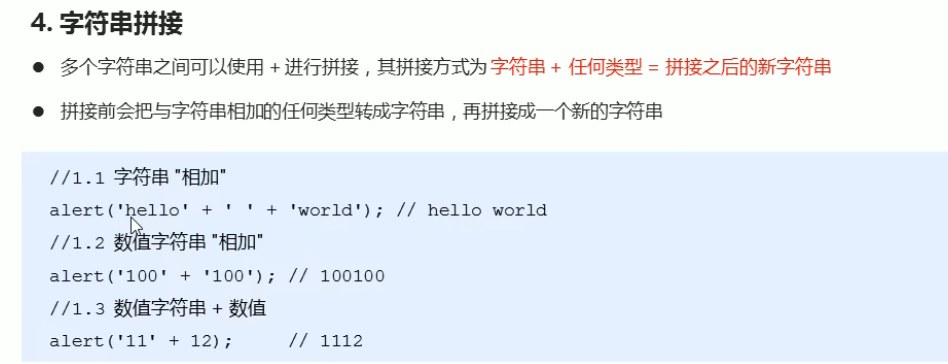

## JavaScript基础语法

> **在HTML中，推荐使用双引号。**
>
> **在JavaScript中，推荐使用单引号。**
>
> 符号两端最好各自有一个空格，推荐插件`JS-CSS-HTML Formatter`可以直接格式化

### 1.初识JavaScript

- JavaScript是一种运行在客户端的脚本语言（不需要编译，通过js解释器逐行解释并执行）
- 可以通过Node.js进行服务器端的编程

- JavaScript最初的目的是为了进行表单动态校验的

#### 1.1浏览器如何执行js


- 渲染引擎
- JS引擎

#### 1.2数据类型


- JavaScript是一种弱类型/动态语言，不用提前声明白变量的类型，在程序的运行过程中，类型会自动被确定
- 变量的数据类型是根据`=`右边的值的数据类型来确定的
- JavaScript是动态语言，变量的数据类型是可以变化的

- 数字型Number：有三个特殊值：

  - `infinity` 正无穷
  - `-infinity` 负无穷
  - `NaN (Not a Number)` 结果不是数字

- 八进制：在数字前加`0`（数字零）

- 十六进制：在数字前加`0x`

- 字符串可以单双引号互相嵌套：（但肯定转义符更好，这边主要是为了提醒一下，还有这种表示方法）

  ```js
  let aString= '这句话是"单引号"嵌套双引号'
  ```

- 字符串拼接：

  

#### 1.3解释型语言和编译型语言


#### 1.4运算符

- 常见的基础用法

  

- 前置/后置递增运算符（注意运算顺序即可）

  实际开发过程中，使用后置运算符，并独占一行

  ```javascript
  //前置运算符
  let a=10,b=10;
  let c= ++a + b;//21
  let d= a + b;//21
  //等效于
  let a=10,b=10;
  a=a+1;
  let c= a + b;//21
  let d= a + b;//21
  ```

  ```js
  //后置运算符
  let a=10,b=10;
  let c= a++ + b;//20
  let d= a + b;//21
  //等效于
  let a=10,b=10;
  let c= a + b;//20
  a=a+1;
  let d= a + b;//21
  ```

  

- 比较运算符

  - `==`默认转换数据类型

    ```js
    console.log(12 == 12); //true
    console.log(12 == '12'); //true
    ```

  - 避免上述情况，有全等的概念`===`，要求数据和数据类型都一样

    ```js
    console.log(12 === 12); //true
    console.log(12 === '12'); //false
    ```

    

  - `!==` 和`===`只有在两边数据类型相等的情况下才会比较数值，其余的比较运算符，会先转换数据类型，再进行比较

- 逻辑运算符

  - 短路中断（逻辑中断）

    **运算原理：**当有多个表达式/值时，左边的表达式可以**确定结果**（指的是确定逻辑运算的结果）时，就不再计算右边表达式的值

    **（总结：在哪个位置确定的结果，就返回哪个位置表达式的原值，发生中断）**

    - 逻辑与的逻辑中断

      执行过程：

      - javascript依次获取每一个操作数，将它们转换为布尔变量，如果是false，则直接返回这个操作数的值（注意，`返回的是转换前的原值`，不一定是布尔类型），中断后面操作数的处理；

      - 否则继续处理下一个操作数。如果直到最后一个操作数仍然对应布尔变量true，则返回最后这个操作数的值。

      ```JavaScript
      /*
      表达式1		&& 		表达式2
      从左往右数，哪个表达式是false就返回谁的原值，并且中断停止不再继续。
      如果全都是true就返回最后一个表达式2的原值。
      */
      	document.write(123 && 456); 				 返回值为456
      	document.write(0 && 456); 					 返回值为0
      	document.write(0 && 1 + 2 && 456 * 56789);   返回值为0
      	document.write('' && 1 + 2 && 456 * 56789); 返回值为空白（空的字符串）
      
      ```

    - 逻辑或的逻辑中断

      执行过程：

      - javascript依次获取每一个操作数，将它们转换为布尔变量，如果是true，则直接返回这个操作数的值（注意，`返回的是转换前的原值`，不一定是布尔类型），中断后面操作数的处理；
      - 否则继续处理下一个操作数。如果直到最后一个操作数仍然对应布尔变量true，则返回最后这个操作数的值。

      ```js
      /*
      表达式1 		||		表达式2
      从左往右数，哪个表达式是true就返回谁的原值，并且中断停止不再继续。
      如果全都是false就返回最后一个表达式2的原值。
      */
      	document.write(123 || 456); 			 	 返回值为123
      	document.write(123 || 456 || 456 + 123); 	 返回值为123
      	document.write(0 || 456 || 456 + 123);  	 返回值为456
      ```

      

    - 逻辑中断的重要问题！

      ```js
      //看此处代码
      // 一个易错案例
      console.log('接下来将展示一个逻辑中断的应用');
      let testNum = 0;
      console.log(123 || testNum++); //123
      console.log(testNum); //0
      //第五行中，123为真，发生逻辑中断，testNum++将不再运行，值仍为0
      ```

- 空值合并运算符`??`

  `a ?? b` 的结果是：

  - 如果 `a` 是已定义的，则结果为 `a`，
  - 如果 `a` 不是已定义的，则结果为 `b`

  类似的，和上文中提到的或的逻辑中断有异曲同工之妙

  它们之间重要的区别是：

  - `||` 返回第一个 **真** 值。
  - `??` 返回第一个 **已定义的** 值。

  换句话说，`||` 无法区分 `false`、`0`、空字符串 `""` 和 `null/undefined`。它们都一样 —— 假值（falsy values）。如果其中任何一个是 `||` 的第一个参数，那么我们将得到第二个参数作为结果。

- 赋值运算符：

  

- 运算符优先级

  

#### 1.5流程控制-分支

- [三元表达式](https://zh.javascript.info/ifelse)，借助`条件运算符？`

  语法：

  ```javascript
  //由三部分组成 ①表达式 ？ ②value1 : ③value2;
  let result = condition ? value1 : value2;
  ```

  计算条件结果，如果结果为真，则返回 `value1`，否则返回 `value2`。

  例如：

  ```javascript
  let accessAllowed = (age > 18) ? true : false;
  ```

  技术上讲，我们可以省略 `age > 18` 外面的括号。**问号运算符的优先级较低**，所以它会在比较运算符 `>` 后执行。

  下面这个示例会执行和前面那个示例相同的操作：

  ```javascript
  // 比较运算符 "age > 18" 首先执行
  //（不需要将其包含在括号中）
  let accessAllowed = age > 18 ? true : false;
  ```

  **但括号可以使代码可读性更强，所以我们建议使用它们**

  多个三元运算符号的使用例子：

  例如：

  ```javascript
  let age = prompt('age?', 18);
  
  let message = (age < 3) ? 'Hi, baby!' :
    (age < 18) ? 'Hello!' :
    (age < 100) ? 'Greetings!' :
    'What an unusual age!';
  
  alert( message );
  ```

  可能很难一下子看出发生了什么。但经过仔细观察，我们可以看到它只是一个普通的检查序列。

  1. 第一个问号检查 `age < 3`。
  2. 如果为真 — 返回 `'Hi, baby!'`。否则，会继续执行冒号 `":"` 后的表达式，检查 `age < 18`。
  3. 如果为真 — 返回 `'Hello!'`。否则，会继续执行下一个冒号 `":"` 后的表达式，检查 `age < 100`。
  4. 如果为真 — 返回 `'Greetings!'`。否则，会继续执行最后一个冒号 `":"` 后面的表达式，返回 `'What an unusual age!'`。

  上述等价为`if .... else if`

- `switch`语句

  `switch` 的例子

  ```javascript
  let a = 2 + 2;
  
  switch (a) {
    case 3:
      alert( 'Too small' );
      break;
    case 4:
      alert( 'Exactly!' );
      break;
    case 5:
      alert( 'Too big' );
      break;
    default:                              //如果没有符合条件的case，将会执行default
      alert( "I don't know such values" );
  }
  ```

  一般来说，`break`是必不可少的，但可以通过这个特性，实现case分组（只是因为break）

  共享同一段代码的几个 `case` 分支可以被分为一组：

  比如，如果我们想让 `case 3` 和 `case 5` 执行同样的代码：

  ```javascript
  let a = 3;
  
  switch (a) {
    case 4:
      alert('Right!');
      break;
  
    case 3: // (*) 下面这两个 case 被分在一组
    case 5:
      alert('Wrong!');
      alert("Why don't you take a math class?");
      break;
  
    default:
      alert('The result is strange. Really.');
  }
  ```

  现在 `3` 和 `5` 都显示相同的信息。

  **[类型很关键](https://zh.javascript.info/switch#lei-xing-hen-guan-jian)**

  强调一下，这里的相等是**严格相等**。被比较的值必须是相同的类型才能进行匹配。

  比如，我们来看下面的代码：

  ```javascript
  let arg = prompt("Enter a value?")
  switch (arg) {
    case '0':
    case '1':
      alert( 'One or zero' );
      break;
  
    case '2':
      alert( 'Two' );
      break;
  
    case 3:
      alert( 'Never executes!' );
      break;
    default:
      alert( 'An unknown value' )
  }
  ```

  1. 在 `prompt` 对话框输入 `0`、`1`，第一个 `alert` 弹出。
  2. 输入 `2`，第二个 `alert` 弹出。
  3. 但是输入 `3`，**因为 `prompt` 的结果是字符串类型的 `"3"`**，不严格相等 `===` 于数字类型的 `3`，所以 `case 3` 不会执行！因此 `case 3` 部分是一段无效代码。所以会执行 `default` 分支。（回顾数据类型的转换，借助`parseInt`函数或者利用`*和-`进行隐式转换）

- `switch`和`if else`

  

  解释一下第三点：因为`switch`是确定了选择值之后**直接跳转**到那个特定的分支，`if else`需要遍历

#### 1.6流程控制-循环

